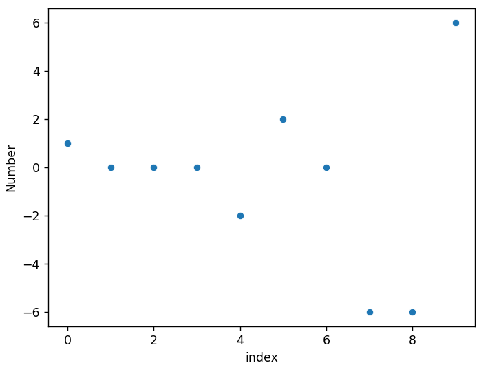
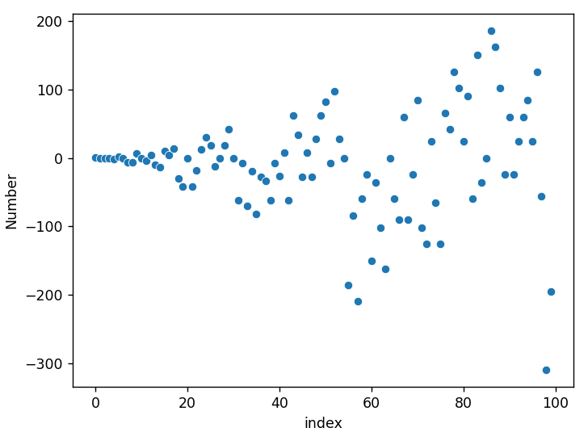
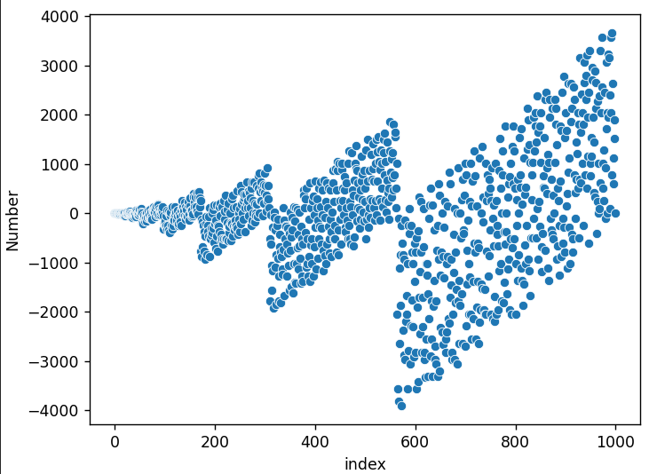
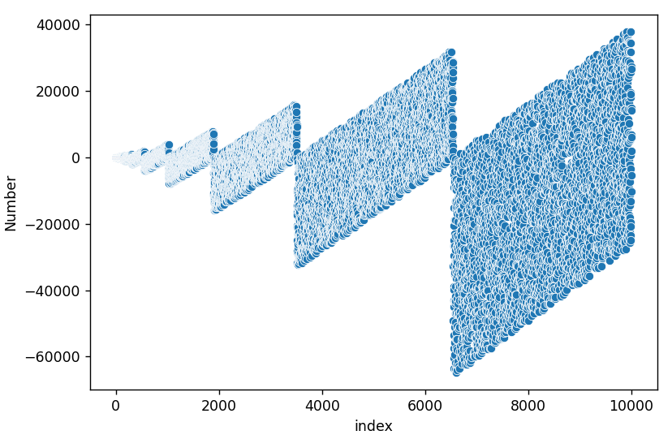
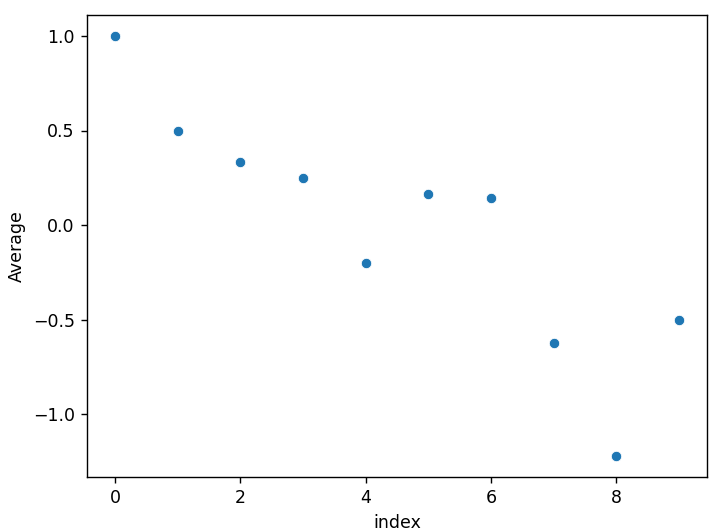
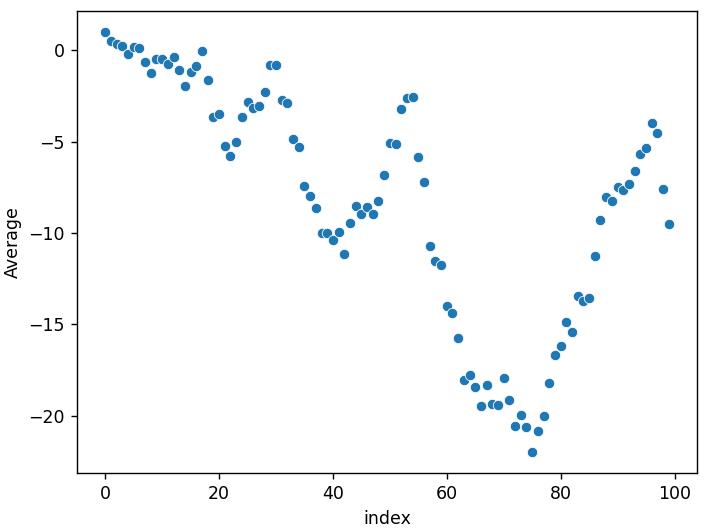
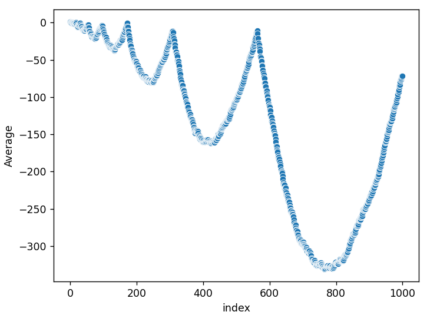
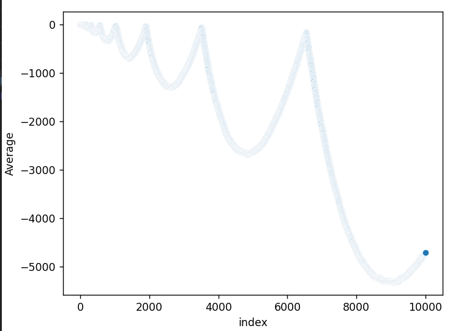

# prime-reversal-sequence
This script generates a particular [prime reversal sequence](https://www.youtube.com/watch?v=pAMgUB51XZA). 

output: `[1, 0, 0, 0, -2, 2, 0, -6, -6, 6, 0, -4, 4, -10, -14, 10, 4, 14, -30, -42]`

# Plotting with Seaborn
## Basic Scatterplots
Scatterplot of 10 numbers:

Scatterplot of 100 numbers:

Scatterplot of 1000 numbers:

Scatterplot of 10000 numbers:

Scatterplot of 100,000 numbers:

## Plotting the Average as $n \to \infty$
Scatterplot of the first 10 averages:

Scatterplot of the first 100 averages:

Scatterplot of the first 1,000 averages:

Scatterplot of the first 10,000 averages:
