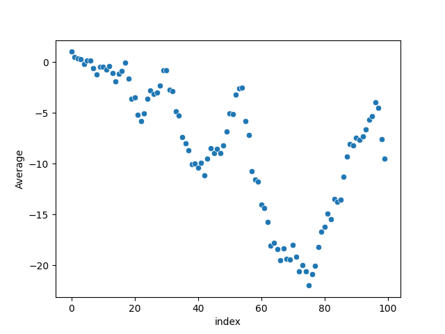

# prime-reversal-sequence
This script generates a particular [prime reversal sequence](https://www.youtube.com/watch?v=pAMgUB51XZA). 

output: `[1, 0, 0, 0, -2, 2, 0, -6, -6, 6, 0, -4, 4, -10, -14, 10, 4, 14, -30, -42, 0, -42, -18, 12, 30, 18, -12, 0, 18, 42, 0, -62, -8, -70, -20, -82, -28, -34, -62, -8, -26, 8, -62, 62, 34, -28, 8, -28, 28, 62, 82, -8, 98, 28, 0, -186, -84, -210, -60, -24, -150, -36, -102, -162, 0, -60, -90, 60, -90, -24, 84, -102, -126, 24, -66, -126, 66, 42, 126, 102, 24, 90, -60, 150, -36, 0, 186, 162, 102, -24, 60, -24, 24, 60, 84, 24, 126, -56, -310, -196]`

# Plotting with Seaborn
## Basic Scatterplots
Scatterplot of 10 numbers:

Scatterplot of 100 numbers:

Scatterplot of 1000 numbers:

Scatterplot of 10000 numbers:

## Plotting the Average as $n \to \infty$
Scatterplot of the first 10 averages:

Scatterplot of the first 100 averages:

Scatterplot of the first 1,000 averages:

Scatterplot of the first 10,000 averages:
